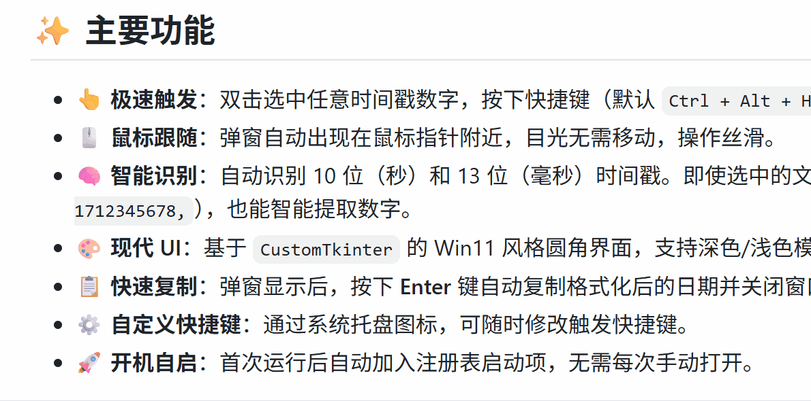

这是我用gemini 3 pro preview生成的时间戳转换小工具。[去下载exe](https://github.com/nmfmn/timestampConverterForWindows/releases/tag/release)




# 🕒 TimeConverter - 极简时间戳转换工具

**TimeConverter** 是一款专为 Windows 11 设计的效率工具。它没有繁琐的主界面，在后台静默运行。当你需要查看时间戳对应的具体时间时，只需一个快捷键，即可在鼠标旁弹出转换结果。

 

## ✨ 主要功能

*   **👆 极速触发**：双击选中任意时间戳数字，按下快捷键（默认 `Ctrl + Alt + H`）即可触发。
*   **🖱️ 鼠标跟随**：弹窗自动出现在鼠标指针附近，目光无需移动，操作丝滑。
*   **🧠 智能识别**：自动识别 10 位（秒）和 13 位（毫秒）时间戳。即使选中的文字包含杂乱字符（如 `"time": 1712345678,`），也能智能提取数字。
*   **🎨 现代 UI**：基于 `CustomTkinter` 的 Win11 风格圆角界面，支持深色/浅色模式适配。
*   **📋 快速复制**：弹窗显示后，按下 **Enter** 键自动复制格式化后的日期并关闭窗口。
*   **⚙️ 自定义快捷键**：通过系统托盘图标，可随时修改触发快捷键。
*   **🚀 开机自启**：首次运行后自动加入注册表启动项，无需每次手动打开。

---

## 📖 使用指南

### 1. 启动软件
双击下载好的 `TimeConverter.exe`。
> *注意：软件为后台静默运行，启动后不会有主窗口弹出，请查看任务栏右下角托盘区是否有蓝色时钟图标。*

### 2. 转换时间戳
1.  在任意软件（VSCode、浏览器、微信、记事本等）中，**选中**一串时间戳数字（例如 `1735468800`）。
2.  按下快捷键 **`Ctrl + Alt + H`**。
3.  屏幕上会弹出转换结果：`2024-12-29 18:40:00`。

### 3. 后续操作
*   **复制日期**：按下 **`Enter`** 键（或点击结果文字），即可将日期复制到剪切板并自动关闭窗口。
*   **关闭弹窗**：点击弹窗以外的任意区域，或按下 `Esc` 键。

### 4. 设置与退出
在屏幕右下角任务栏托盘区找到小图标：
*   **右键 -> 设置快捷键**：修改你的专属热键。
*   **右键 -> 退出**：彻底关闭程序。

---

## ❓ 常见问题 (FAQ)

**Q: 按下快捷键没反应？**
*   **A1**: 请检查右下角托盘区是否有软件图标，确保软件正在运行。
*   **A2**: 如果你在**任务管理器**或**以管理员身份运行的游戏/软件**中操作，请尝试**以管理员身份运行**本工具（右键 exe -> 以管理员身份运行）。

**Q: 为什么弹窗提示“未识别到时间戳”？**
*   **A**: 说明你选中的内容里没有包含有效的 10 位或 13 位数字。请重新选择数字部分再试。

**Q: 杀毒软件报毒？**
*   **A**: 由于软件使用了全局键盘监听（用于检测快捷键）和注册表操作（用于开机自启），可能会被 360 等软件误报。建议添加至信任列表。

---

## 💻 开发者指南 (源码编译)

如果你想自己修改代码或重新打包，请参考以下步骤。

### 1. 环境准备
确保已安装 Python 3.x，并安装相关依赖库：

```bash
pip install customtkinter keyboard pyperclip pystray Pillow pyinstaller
```

### 2. 运行源码
```bash
python main.py
```

### 3. 打包成 EXE
由于使用了 `customtkinter`，打包时必须使用 `--collect-all` 参数来包含 UI 资源文件：

**静默版（推荐，无黑窗口）：**
```bash
python -m PyInstaller --noconsole --onefile --name "TimeConverter" --collect-all customtkinter main.py
```

**调试版（带黑窗口，用于排查错误）：**
```bash
python -m PyInstaller --onefile --name "TimeConverter" --collect-all customtkinter main.py
```

---

## 📝 更新日志

*   **v1.0.0**: 初始版本发布。
    *   实现双击选中 + 快捷键触发。
    *   增加系统托盘和设置功能。
    *   修复窗口闪退和快捷键冲突问题。
    *   增加鼠标跟随弹窗逻辑。

---

**Enjoy your coding! 🚀**